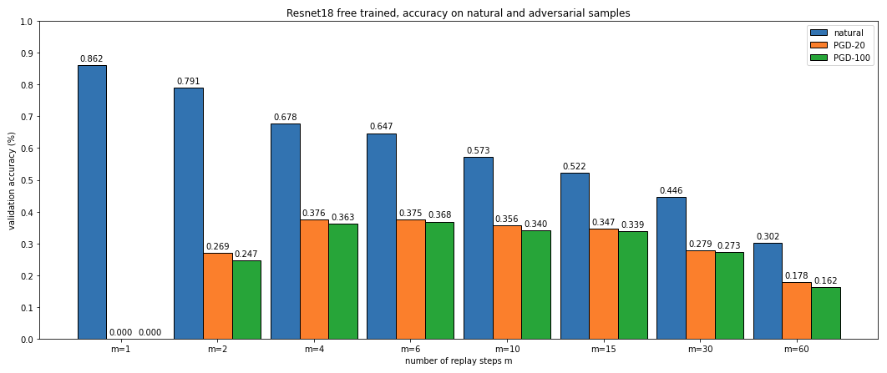

# Adversarial Training for Free
To execute the code it is sufficient to run all the cells in the notebook.
There is just a block ("Testing Instructons") that takes about 20 minutes to be executed.

This plot represents the overall results obtained by our project.

